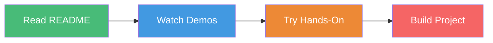

# 📖 Quick Start Guide - Aera Training Module 1

## ⚡ 5-Minute Quick Start

### Step 1: Understand the Foundation
```
📚 Aera Platform = Process Builder + Rules Builder + Skill Configuration
```

### Step 2: Three Core Components

| Component | What It Does | Time to Learn |
|-----------|-------------|---------------|
| 🔄 Process Builder | Workflow orchestration | 2-3 hours |
| 📐 Rules Builder | Business logic | 2-3 hours |
| ⚙️ Skill Configuration | Decision execution | 2-3 hours |

### Step 3: Your Learning Path



## 🎯 Today's Goal

**Complete one hands-on exercise from each component:**
- [ ] Process Builder - Exercise 1
- [ ] Rules Builder - Exercise 1  
- [ ] Skill Configuration - Exercise 1

## 📚 Resources

- [Full README](README.md) - Complete learning guide
- [Contributing](CONTRIBUTING.md) - How to contribute
- [PDF Docs](docs/) - Original training materials

## 🆘 Need Help?

1. Check the [README](README.md) for detailed explanations
2. Review the PDF materials in `/docs`
3. Open an issue on GitHub
4. Join the community discussions

---

**Let's start learning! 🚀**

[← Back to Main README](README.md)
