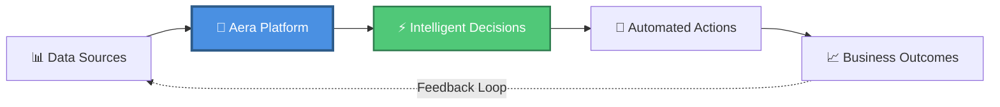

<!-- Banner -->
<div align="center">

# 🚀 Aera Decision Cloud Platform
## Learning Journey for Technical Professionals

[](https://github.com/patilanupam/Aera_Hands-on)
[](https://github.com/patilanupam/Aera_Hands-on)
[](https://github.com/patilanupam/Aera_Hands-on)
[](https://github.com/patilanupam/Aera_Hands-on)
[](https://github.com/patilanupam/Aera_Hands-on)


</div>

---

## 📚 Overview

<div align="center">

### Welcome to your comprehensive guide to the **Aera Decision Cloud Platform**!

*Designed for Cloud Engineers, AI Engineers, Azure Architects, DevOps Engineers,*  
*and anyone stepping into the world of autonomous enterprise decision-making.*

</div>

**Aera is not just another automation tool**—it's an intelligent decision-making platform that combines AI, business logic, and process orchestration to help enterprises make faster, smarter decisions at scale.



---

<div align="center">

### 📖 Navigation

[](QUICKSTART.md)
[](#)
[](CONTRIBUTING.md)
[](https://github.com/patilanupam/Aera_Hands-on/discussions)

</div>

---

## 📑 Table of Contents

<details open>
<summary><b>Click to expand/collapse</b></summary>

- [📚 Overview](#-overview)
- [🎯 Who Should Read This?](#-who-should-read-this)
- [🧭 What is Aera Decision Cloud?](#-what-is-aera-decision-cloud)
- [📖 Module 1: Core Building Blocks](#-module-1-core-building-blocks)
  - [🔄 Process Builder](#-1-process-builder---orchestrating-decision-workflows)
  - [📐 Rules Builder](#-2-rules-builder---codifying-business-logic)
  - [⚙️ Skill Configuration](#️-3-skill-configuration---the-decision-execution-layer)
- [🎓 Hands-On Learning Journey](#-hands-on-learning-journey)
- [🔗 Integration Architecture](#-integration-architecture)
- [🎯 Key Takeaways by Role](#-key-takeaways-by-role)
- [🚀 Next Steps](#-next-steps)
- [📚 Best Practices](#-best-practices)
- [📞 Additional Resources](#-additional-resources)
- [💡 Final Thoughts](#-final-thoughts)

</details>

---

## 🎯 Who Should Read This?

- **Cloud Engineers**: Understanding how Aera integrates with cloud infrastructure and data pipelines
- **AI/ML Engineers**: Learning how AI models integrate into business decision workflows
- **Azure Architects**: Discovering enterprise-grade platform architecture and integration patterns
- **DevOps Engineers**: Implementing CI/CD for decision automation and skill deployments
- **Business Analysts**: Bridging the gap between business logic and technical implementation
- **Data Scientists**: Connecting predictive models with operational decision-making

---

## 🧭 What is Aera Decision Cloud?

Aera Decision Cloud is an **enterprise decision intelligence platform** that:

- **Automates Complex Business Decisions**: From supply chain optimization to financial planning
- **Integrates AI/ML Models**: Seamlessly incorporates predictive analytics into workflows
- **Orchestrates Processes**: Manages end-to-end business processes with real-time data
- **Provides Transparency**: Explains every decision with full audit trails
- **Scales Enterprise-Wide**: Handles millions of decisions across global operations

Think of it as the **"brain"** of your enterprise that continuously:
1. **Senses** → Monitors data from multiple sources
2. **Thinks** → Applies AI, rules, and business logic
3. **Acts** → Executes decisions or recommendations
4. **Learns** → Improves over time through feedback loops

---

## 📖 Module 1: Core Building Blocks

This training module covers three fundamental components of the Aera platform:

### 1. **Process Builder** 🔄
### 2. **Rules Builder** 📐
### 3. **Skill Configuration** ⚙️

Let's explore each one from multiple perspectives...

---

## 🔄 1. Process Builder - Orchestrating Decision Workflows

### What is it?
Process Builder is the **workflow orchestration engine** where you design, configure, and manage automated decision processes.

### 🎨 From a Cloud Engineer's Perspective

**Think of it as:**
- Similar to **Azure Logic Apps** or **AWS Step Functions**, but for business decisions
- Event-driven architecture with triggers and actions
- Integration points with cloud services, APIs, and data lakes

**Key Concepts:**
```
Data Ingestion → Process Triggers → Decision Logic → Actions → Monitoring
```

**What You'll Build:**
- **Process Flows**: Visual workflows that map business processes
- **Event Triggers**: Condition-based process initiations
- **Data Transformations**: ETL-like operations within workflows
- **Integration Points**: Connectors to ERP, CRM, data warehouses

**Technical Skills Applied:**
- API integration patterns
- Event-driven architecture
- Data pipeline design
- Error handling and retry logic

---

### 🤖 From an AI/ML Engineer's Perspective

**What Makes It Unique:**
- **AI Model Integration Points**: Where ML predictions feed into business processes
- **Real-time Inference**: Decisions made with live model predictions
- **Feedback Loops**: Capturing outcomes to retrain models

**Example Use Case:**
```
Demand Forecast Model → Process Builder → Inventory Replenishment Decision
                ↓
        Actual Sales Data
                ↓
        Model Retraining Pipeline
```

**What You'll Learn:**
- How to operationalize ML models in production workflows
- Feature engineering within process contexts
- A/B testing business decisions
- Model monitoring and drift detection integration

---

### 🏗️ From an Azure Architect's Perspective

**Architecture Patterns:**
- **Microservices Integration**: How Aera processes connect to cloud microservices
- **Data Sovereignty**: Managing data across regions and compliance boundaries
- **High Availability**: Process redundancy and failover mechanisms
- **Security**: Role-based access control (RBAC) and data encryption

**Enterprise Considerations:**
```
┌─────────────────────────────────────────┐
│   Azure Cloud / On-Premise Systems      │
│                                         │
│  ┌──────────┐    ┌─────────────┐      │
│  │   ERP    │───▶│    Aera     │      │
│  └──────────┘    │   Process   │      │
│                  │   Builder   │      │
│  ┌──────────┐    │             │      │
│  │  Data    │───▶│             │      │
│  │  Lake    │    └─────────────┘      │
│  └──────────┘           │              │
│                         ▼              │
│                  ┌─────────────┐      │
│                  │  Decision   │      │
│                  │  Execution  │      │
│                  └─────────────┘      │
└─────────────────────────────────────────┘
```

---

### 🚀 From a DevOps Engineer's Perspective

**CI/CD for Decision Processes:**
- **Version Control**: Process definitions as code
- **Environment Promotion**: Dev → Test → Staging → Production
- **Deployment Strategies**: Blue-green deployments for processes
- **Monitoring**: Process execution metrics and alerting

**DevOps Practices:**
```yaml
# Example: Process Deployment Pipeline
stages:
  - validate_process_definition
  - unit_test_process_logic
  - deploy_to_staging
  - integration_tests
  - approval_gate
  - deploy_to_production
  - monitor_and_rollback_if_needed
```

**What You'll Configure:**
- Process versioning and rollback mechanisms
- Automated testing for business logic
- Performance monitoring and SLAs
- Incident response for failed processes

---

## 📐 2. Rules Builder - Codifying Business Logic

### What is it?
Rules Builder is where **business rules and decision logic** are defined, managed, and executed. It's the "if-this-then-that" engine on steroids.

---

### 💼 From a Business Perspective

**Why It Matters:**
- Business users can define rules **without coding**
- Complex decision trees become transparent and auditable
- Rules can be updated rapidly without IT intervention
- Compliance requirements are explicitly encoded

**Example Business Rules:**
```
IF supplier_lead_time > 30 days
   AND inventory_level < safety_stock
   AND demand_forecast = "High"
THEN 
   CREATE emergency_purchase_order
   NOTIFY procurement_manager
   ESCALATE to_VP_if_amount > $100,000
```

---

### 🧑‍💻 From an AI Engineer's Perspective

**Hybrid Intelligence:**
Rules Builder allows you to combine:
- **Deterministic Rules**: Hard-coded business constraints
- **ML Predictions**: Probabilistic AI outputs
- **Human Judgment**: Escalation points for edge cases

**Example: Intelligent Pricing Decision**
```
1. ML Model predicts optimal price: $47.50
2. Business Rule: "Never price below cost + 15%"
3. Market Rule: "Don't undercut competitor by more than 10%"
4. Final Decision: max($47.50, cost * 1.15, competitor_price * 0.9)
```

**What You'll Build:**
- Rule-based feature validation for ML models
- Business constraint layers over AI recommendations
- Exception handling for model uncertainties
- Explainability frameworks (why this decision?)

---

### 🔍 From a Data Science Perspective

**Rules as Data:**
- Decision rules generate **valuable metadata**
- Analysis: Which rules fire most frequently?
- Optimization: Which rules conflict or create bottlenecks?
- Pattern Discovery: Rule effectiveness correlations

**Analytics Use Cases:**
```sql
-- Example: Analyzing Rule Performance
SELECT 
    rule_name,
    COUNT(*) as execution_count,
    AVG(decision_time_ms) as avg_latency,
    SUM(CASE WHEN outcome = 'success' THEN 1 ELSE 0 END) as success_rate
FROM rule_execution_log
GROUP BY rule_name
ORDER BY execution_count DESC;
```

---

### 🏛️ From an Enterprise Architect's Perspective

**Governance & Compliance:**
- **Audit Trails**: Every decision is logged with the exact rules applied
- **Version Control**: Rule changes are tracked historically
- **Approval Workflows**: Critical rules require multi-level sign-off
- **Testing**: Regression testing for rule modifications

**Rule Management Architecture:**
```
Rule Definition (Business Users)
        ↓
Rule Validation (QA Team)
        ↓
Rule Approval (Compliance/Legal)
        ↓
Rule Deployment (DevOps)
        ↓
Rule Execution (Aera Engine)
        ↓
Rule Monitoring (Analytics)
```

---

## ⚙️ 3. Skill Configuration - The Decision Execution Layer

### What is it?
Skills are **executable decision capabilities** that Aera can perform. Think of them as intelligent microservices that can sense, think, and act.

---

### 🛠️ From a Cloud Engineer's Perspective

**Skills as Cloud Functions:**
- Similar to **Azure Functions** or **AWS Lambda**, but decision-focused
- Stateful execution with context awareness
- Auto-scaling based on decision volume
- Integration with cloud services

**Skill Anatomy:**
```
Input: Real-time data + Historical context
  ↓
Processing: Rules + AI Models + Business Logic
  ↓
Output: Decision + Confidence Score + Explanation + Actions
```

**What You'll Configure:**
- Skill dependencies and initialization
- Resource allocation and scaling policies
- Input/output data schemas
- Error handling and fallback strategies

---

### 🤖 From an AI/ML Engineer's Perspective

**Skills = Model + Logic + Context**

A Skill might include:
1. **Data Preprocessing**: Feature extraction and normalization
2. **Model Inference**: Real-time predictions
3. **Post-processing**: Business rule application
4. **Action Planning**: What to do with the decision
5. **Explanation Generation**: Why this decision was made

**Example: Inventory Replenishment Skill**
```python
# Conceptual Skill Structure
class InventoryReplenishmentSkill:
    def execute(self, context):
        # 1. Get real-time data
        current_inventory = context.get('inventory_level')
        demand_forecast = ml_model.predict(context.features)
        
        # 2. Apply business rules
        if current_inventory < safety_stock:
            order_quantity = demand_forecast * lead_time
            
            # 3. Optimize with constraints
            order_quantity = optimize(
                quantity=order_quantity,
                constraints=[budget_limit, supplier_capacity]
            )
            
            # 4. Generate explanation
            explanation = f"Ordering {order_quantity} units because..."
            
            # 5. Execute action
            return Decision(
                action='CREATE_PURCHASE_ORDER',
                quantity=order_quantity,
                confidence=0.87,
                explanation=explanation
            )
```

---

### 🔄 From a DevOps Engineer's Perspective

**Skill Lifecycle Management:**

```
Development → Testing → Deployment → Monitoring → Optimization
     ↑                                                    │
     └────────────── Feedback Loop ──────────────────────┘
```

**What You'll Manage:**
- **Skill Versioning**: A/B testing different skill versions
- **Performance Monitoring**: Latency, throughput, accuracy
- **Dependency Management**: Libraries, models, external APIs
- **Rollback Procedures**: Quick reversion to stable versions
- **Scaling**: Auto-scaling based on decision demand

**Key Metrics to Monitor:**
```yaml
Skill Performance Metrics:
  - execution_latency_p95: <500ms
  - success_rate: >99.5%
  - decision_accuracy: >95%
  - resource_utilization: <70%
  - error_rate: <0.1%
```

---

### 📊 From a Data Scientist's Perspective

**Skills Generate Rich Data:**
Every skill execution creates:
- **Input Features**: What data was used?
- **Decision Outputs**: What was decided?
- **Outcomes**: What actually happened?
- **Feedback**: Was the decision correct?

**Continuous Improvement:**
```
Skill Execution Data
        ↓
Performance Analysis
        ↓
Feature Engineering Insights
        ↓
Model Retraining
        ↓
Updated Skill Deployment
        ↓
    (Repeat)
```

**What You'll Analyze:**
- Decision effectiveness over time
- Feature importance and drift
- Edge cases requiring new rules
- Opportunities for model improvements

---

## 🎓 Hands-On Learning Journey

### Module Structure

Each hands-on exercise follows this pattern:

1. **Business Context** → Understand the real-world problem
2. **Data Setup** → Configure data sources and connections
3. **Process Design** → Build the workflow in Process Builder
4. **Rules Definition** → Codify business logic in Rules Builder
5. **Skill Configuration** → Set up the decision execution
6. **Testing** → Validate with test scenarios
7. **Deployment** → Push to production environment
8. **Monitoring** → Track performance and outcomes

---

### 🏋️ Exercise 1: Process Builder Hands-On

**Scenario**: Automating Supply Chain Decision Workflows

**What You'll Build:**
- Data ingestion process from ERP systems
- Event-driven triggers (e.g., inventory below threshold)
- Multi-step approval workflows
- Integration with downstream systems

**Technical Learning:**
- JSON/XML data parsing
- REST API integration
- Conditional logic and branching
- Error handling patterns

**Business Learning:**
- Supply chain process flows
- Stakeholder approval hierarchies
- Data quality requirements
- Exception management

---

### 🏋️ Exercise 2: Rules Builder Hands-On

**Scenario**: Creating Intelligent Pricing Rules

**What You'll Build:**
- Base pricing rules with cost constraints
- Competitive pricing intelligence rules
- Dynamic discount rules based on inventory
- Approval thresholds for large price changes

**Technical Learning:**
- Rule syntax and operators
- Priority and conflict resolution
- Rule testing frameworks
- Performance optimization

**Business Learning:**
- Pricing strategy fundamentals
- Margin protection mechanisms
- Competitive positioning
- Revenue optimization

---

### 🏋️ Exercise 3: Skill Configuration Hands-On

**Scenario**: Deploying a Demand Forecasting Skill

**What You'll Build:**
- Skill input/output schema definition
- Integration with ML model endpoints
- Business rule overlays
- Action execution (e.g., creating purchase orders)

**Technical Learning:**
- Skill lifecycle management
- Model versioning and rollback
- A/B testing strategies
- Performance tuning

**Business Learning:**
- Forecast accuracy metrics
- Safety stock calculations
- Lead time management
- Supplier collaboration

---

## 🔗 Integration Architecture

### How It All Connects

```
┌─────────────────────────────────────────────────────────────┐
│                    Aera Decision Cloud                      │
│                                                             │
│  ┌───────────────┐    ┌──────────────┐    ┌─────────────┐ │
│  │   Process     │───▶│    Rules     │───▶│   Skills    │ │
│  │   Builder     │    │   Builder    │    │   Engine    │ │
│  └───────────────┘    └──────────────┘    └─────────────┘ │
│         │                     │                    │        │
│         └─────────────────────┴────────────────────┘        │
│                              │                              │
└──────────────────────────────┼──────────────────────────────┘
                               │
                ┌──────────────┼──────────────┐
                │              │              │
         ┌──────▼─────┐ ┌─────▼──────┐ ┌────▼─────┐
         │   Data     │ │  External  │ │  Action  │
         │  Sources   │ │  AI/ML     │ │ Systems  │
         │ (ERP, CRM) │ │  Models    │ │(Orders,  │
         └────────────┘ └────────────┘ │ Alerts)  │
                                       └──────────┘
```

---

## 🎯 Key Takeaways by Role

### For Cloud Engineers
✅ Understand cloud-native decision automation
✅ Master API-driven integration patterns
✅ Configure scalable, resilient workflows
✅ Implement enterprise security standards

### For AI/ML Engineers
✅ Operationalize ML models in production
✅ Combine deterministic and probabilistic logic
✅ Build explainable AI decision systems
✅ Create continuous learning feedback loops

### For Azure Architects
✅ Design enterprise decision architectures
✅ Implement governance and compliance frameworks
✅ Plan multi-region deployments
✅ Optimize for performance and cost

### For DevOps Engineers
✅ Automate decision process deployments
✅ Implement CI/CD for business logic
✅ Monitor and optimize decision performance
✅ Manage versions and rollbacks effectively

### For Data Scientists
✅ Connect analytics to operational decisions
✅ Generate insights from decision metadata
✅ Optimize decision rules with data
✅ Validate model effectiveness in production

---

## 📚 Best Practices

### 1. **Start Simple, Scale Gradually**
   - Begin with one process, one rule set, one skill
   - Validate thoroughly before expanding
   - Learn from production feedback

### 2. **Think End-to-End**
   - Process → Rules → Skills → Actions → Outcomes
   - Every decision should have measurable impact
   - Close the feedback loop

### 3. **Embrace Collaboration**
   - Business defines "what" (requirements)
   - Technology defines "how" (implementation)
   - Data Science defines "why" (insights)

### 4. **Maintain Transparency**
   - Document every process and rule
   - Generate explanations for decisions
   - Keep audit trails for compliance

### 5. **Iterate and Improve**
   - Monitor decision effectiveness
   - Continuously refine rules and models
   - Update processes based on changing business needs

---

## 🚀 Next Steps

After completing this module, you'll be ready to:

1. **Design Complex Decision Workflows** across your enterprise
2. **Integrate AI/ML Models** into business processes
3. **Configure Scalable Skills** for autonomous decision-making
4. **Deploy Production-Grade Solutions** with confidence
5. **Optimize and Monitor** decision performance

---

## 📞 Additional Resources

### Documentation
- Aera Platform API Reference
- Process Builder User Guide
- Rules Builder Syntax Documentation
- Skill Development SDK

### Community
- Aera Developer Forums
- GitHub repositories (if available)
- Slack/Teams channels
- Training webinars

### Certification Paths
- Aera Certified Developer
- Aera Solutions Architect
- Aera Decision Intelligence Specialist

---

## 🙏 Acknowledgments

This learning journey is part of the **Aera Training Program - Module 1**. 

**Training Materials:**
- Process Builder Hands-on (Fall 2024)
- Rules Builder Hands-on (Fall 2024)
- Skill Configuration Hands-on (Fall 2024)

---

## 📝 Notes for Learners

### As You Progress:
- **Take Notes**: Document your learnings and gotchas
- **Experiment**: Try variations beyond the exercises
- **Ask Questions**: No question is too basic
- **Build Real Scenarios**: Apply to your actual business problems
- **Share Knowledge**: Teach others what you've learned

### Common Pitfalls to Avoid:
⚠️ Over-complicating initial processes
⚠️ Ignoring error handling
⚠️ Not testing with edge cases
⚠️ Forgetting about performance implications
⚠️ Skipping documentation

---

## 💡 Final Thoughts

**Aera Decision Cloud isn't just about automation—it's about augmentation.**

The platform empowers you to:
- Make **faster** decisions with real-time data
- Make **better** decisions with AI insights
- Make **scalable** decisions across thousands of scenarios
- Make **transparent** decisions with full explanations

Whether you're a Cloud Engineer building infrastructure, an AI Engineer deploying models, an Architect designing solutions, or a DevOps Engineer managing deployments—Aera provides the framework to turn decision-making into a competitive advantage.

**Welcome to the future of enterprise decision intelligence! 🚀**

---

*Last Updated: January 2026*  
*Module: 1 - Foundation*  
*Status: Active Learning*

