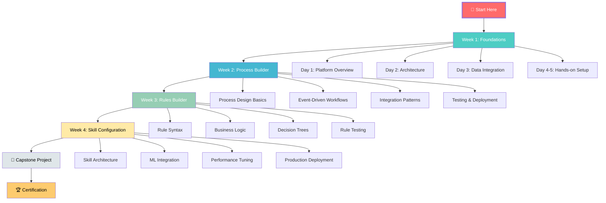
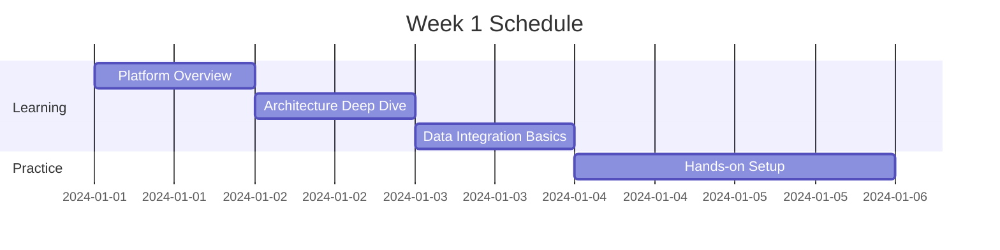
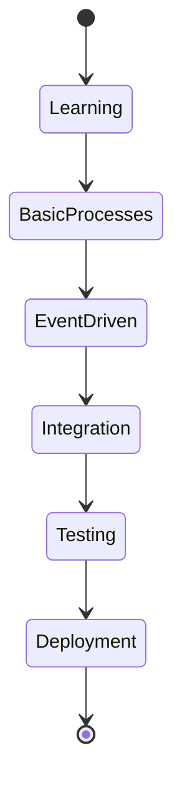
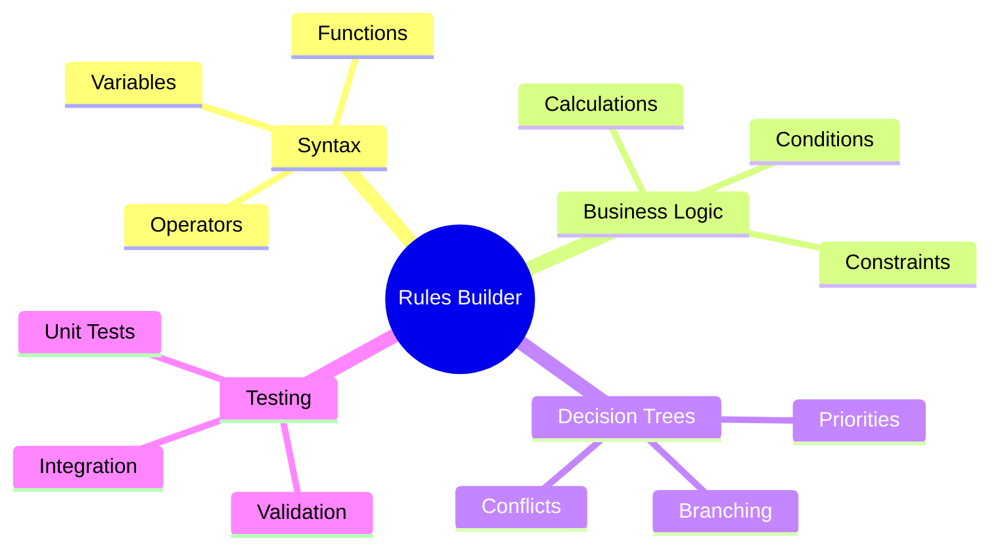
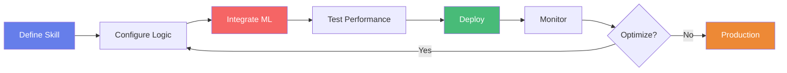
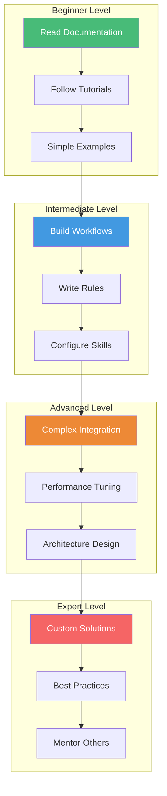
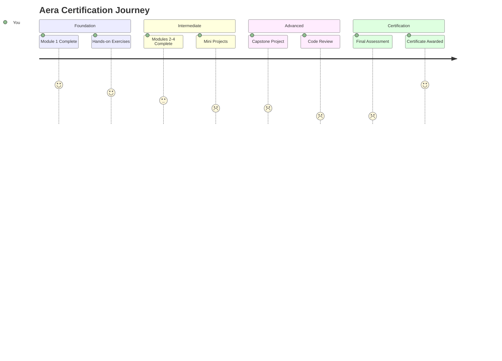
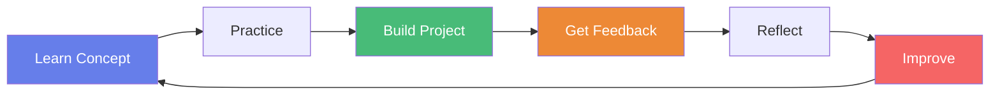

# 🗺️ Visual Learning Roadmap - Aera Platform

## 📊 Your Complete Learning Journey

---

## 🎓 Week-by-Week Breakdown

### 📅 Week 1: Platform Foundations
**Goal**: Understand Aera's core concepts and architecture

**Deliverables:**
- ✅ Complete platform setup
- ✅ Understand decision flow
- ✅ Configure first data source

---

### 📅 Week 2: Process Builder Mastery
**Goal**: Design and deploy decision workflows

**Deliverables:**
- ✅ 3 working process workflows
- ✅ Event trigger configurations
- ✅ API integration examples

---

### 📅 Week 3: Rules Builder Excellence
**Goal**: Codify complex business logic

**Deliverables:**
- ✅ 5 rule sets implemented
- ✅ Decision tree for pricing
- ✅ Rule testing framework

---

### 📅 Week 4: Skill Configuration Pro
**Goal**: Deploy intelligent decision capabilities

**Deliverables:**
- ✅ 2 production skills
- ✅ ML model integration
- ✅ Performance metrics dashboard

---

## 🎯 Skill Progression Matrix

---

## 📈 Your Progress Tracker

Copy this into your notes and check off as you go!

### Module 1: Foundation ✅
- [x] Understanding Aera Platform
- [x] Core Components Overview
- [ ] Complete Hands-on 1
- [ ] Complete Hands-on 2
- [ ] Complete Hands-on 3

### Module 2: Process Builder 🔄
- [ ] Basic Process Design
- [ ] Event-Driven Architecture
- [ ] API Integrations
- [ ] Error Handling
- [ ] Testing & Deployment

### Module 3: Rules Builder 📐
- [ ] Rule Syntax Mastery
- [ ] Business Constraints
- [ ] Decision Logic
- [ ] Priority Management
- [ ] Rule Testing

### Module 4: Skill Configuration ⚙️
- [ ] Skill Architecture
- [ ] ML Model Integration
- [ ] Performance Optimization
- [ ] Production Deployment
- [ ] Monitoring & Alerts

### Capstone Project 🚀
- [ ] Project Planning
- [ ] Design Documentation
- [ ] Implementation
- [ ] Testing
- [ ] Presentation

---

## 🎓 Certification Path

---

## 💡 Tips for Success

### ⏰ Time Management
| Activity | Daily Time | Weekly Total |
|----------|-----------|--------------|
| 📚 Reading | 1 hour | 5 hours |
| 💻 Hands-on | 2 hours | 10 hours |
| 🎥 Videos | 30 min | 2.5 hours |
| 🤔 Practice | 1 hour | 5 hours |
| **Total** | **4.5 hours** | **22.5 hours** |

### 🎯 Learning Strategies
1. **Active Learning**: Don't just read, do!
2. **Build Projects**: Apply concepts immediately
3. **Ask Questions**: Use community forums
4. **Teach Others**: Best way to solidify knowledge
5. **Review Regularly**: Spaced repetition works

---

## 🔄 Continuous Improvement Loop

---

**Ready to begin? Start with [Quick Start Guide](QUICKSTART.md)!**

[← Back to Main README](README.md)
